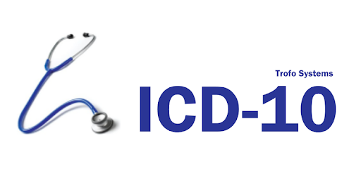
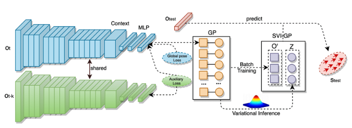
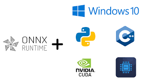

# Machine Learning Projects
Start from basic projects on natural Language Processing. Use bayes and some basic language libraries to solve the given problem like:
Separation of diseases and classification of diseases from hospital discharge papers
Classification of disease codes (ICD10)
Suggest next word, correct word...
Classify sentences...

# Deep Learning Projects

From building basic models such as classify Images applying CNN to higher models using larger backbones such as Inception, Mobile Net, Xception, Densnet, Resnet... 
> Application in predicting position, coordinates, object identification, OCR text many applications in life.

# Build models and Convert Framework. Deployment Products

Application development of tensorflow and Pytorch models.
Convert models to be more compact in size, library use, and computational structure.
> Quarantine :F64-F32-F16.  
> Tensor protobufer, TensorRT, Tensorlite, Onnx, OpenVINO... </r>
> Using dev Board, Embedding Board. Jetson family, Coral Devboar, Coral accelerator, Raspberry  

